# DIY Electroluminescence Flatfield Panel

## Overview

Features:

- Software controlled brightness

- Motorized telescope cover

- "Alnitak Generic Commands" compatible protocol

- 3D printed enclosure

The panel is designed for my 120mm refractor. I have mounted a 160mm EL panel into a 3D printed telescope cover. A servo motor opens and closes the cover.

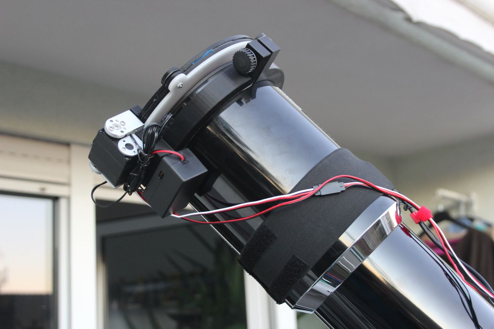

Brightness and open/close operation are controlled by software using an "Alnitak Generic Commands" compatible protocol. This protocol is supported by several imaging software, I have tested operation in depth with imaging software "[Voyager](https://software.starkeeper.it/)" and briefly with "[N.I.N.A.](https://nighttime-imaging.eu/)".

Meanwhile I have successfully tested the panel for a whole night of unattended operation with temperatures below 0°C/ 32°F. During this night I shot multiple targets with different rotator angles and got the fitting flats for each rotator position. The imaging software automatically determined the correct brightness for luminance and narrowband filters and a fixed exposure time to fit my flatdark library.

## Panel

The panel is a cheap 160mm EL panel from Aliexpress. The controller is designed to be connected to a 12V inverter.

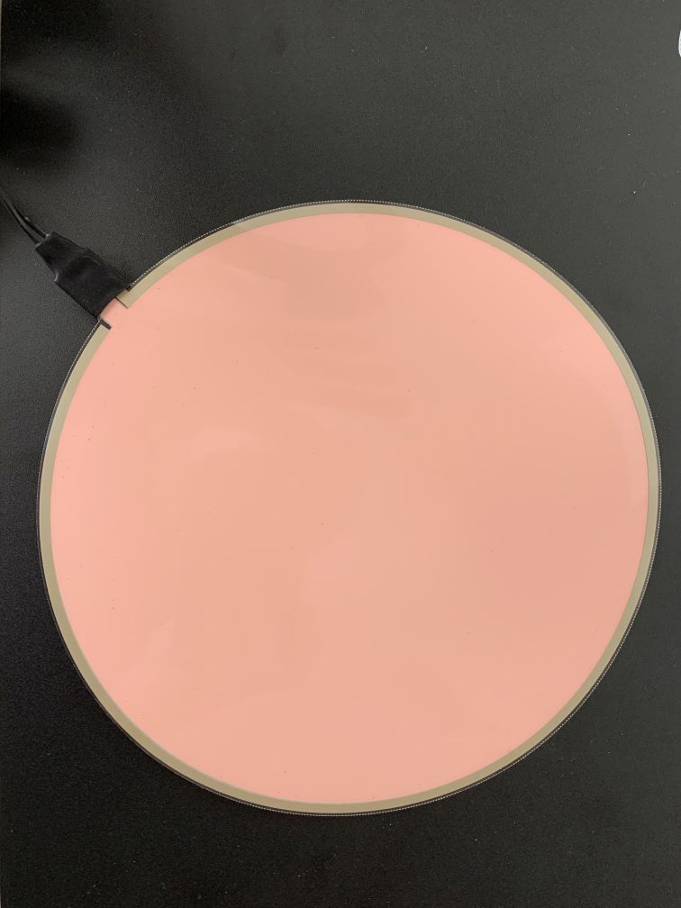

## Enclosure/Mounting

The whole enclosure, servo motor attachment and telescope "tube ring" are 3D printed. I have added a laser cut acrylic diffusor plate, although I don’t know whether this necessary.

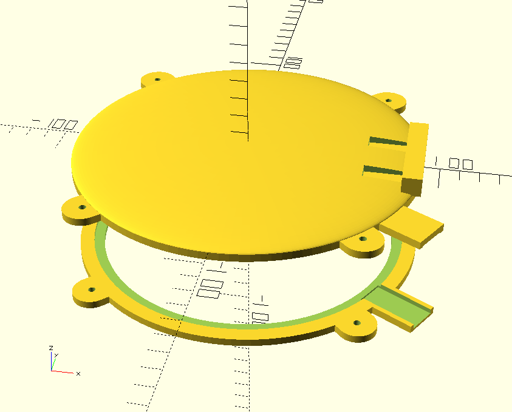

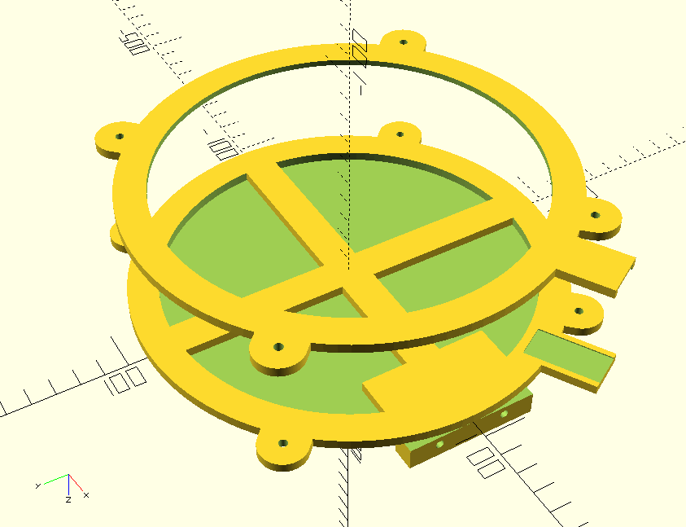

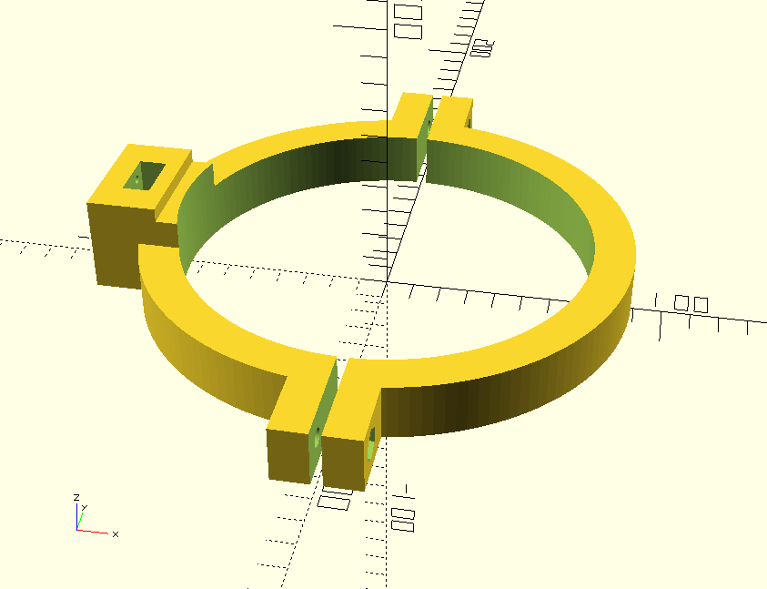

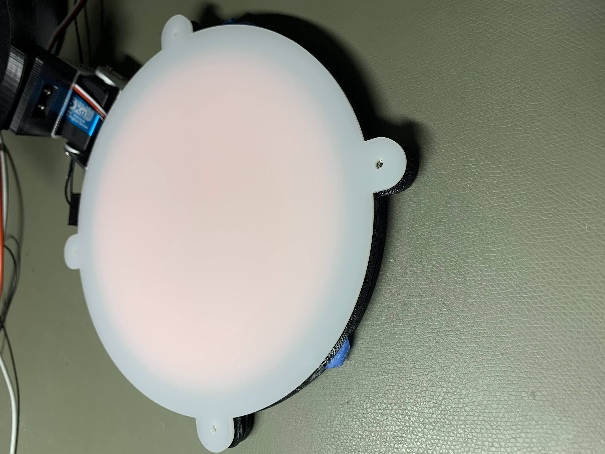

## Controller

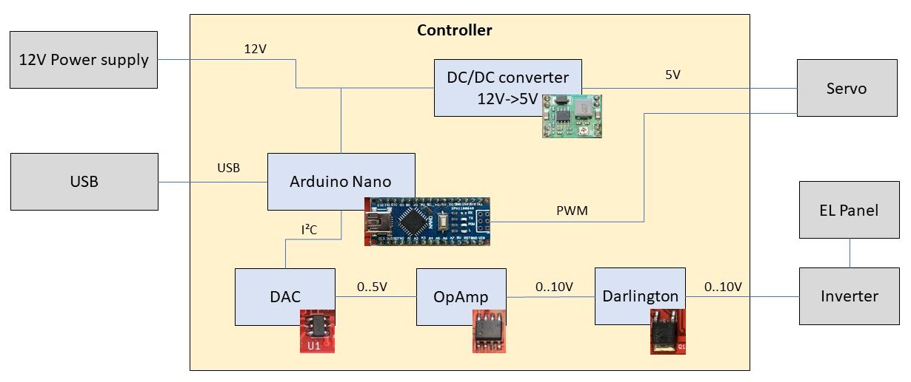

The controller is based on an Arduino Nano. The servo is controlled directly by a PWM pin of the Arduino. The inverter of the EL panel is a 12V inverter and the brightness is dimmed by reducing the inverter input voltage. For that purpose I have used an external DAC MCP4725 (the Arduino analog outputs are just PWM digital outputs) and translated the 0-5V output of this DAC via an OpAmp and a darlington transistor to 0-10V.

I have designed a PCB (using KiCAD) to fit into a very compact project box (8x5x2cm) which remains fixed on the refractor while it is stored in the telescope case. 

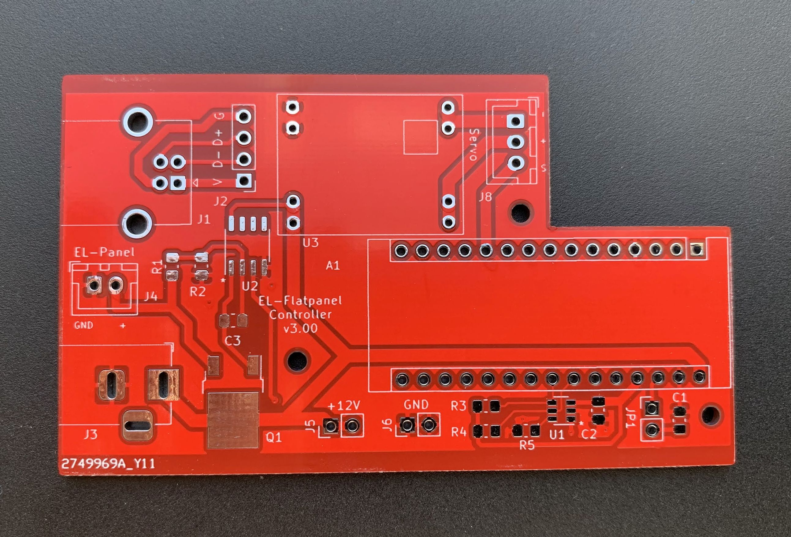

By default, the Arduino resets on each connect by the USB serial port. By shorting JP1 with a jumper this reset can be disabled. This is useful if the controller is connected to software with tight timeouts. You must remove the jumper if you want to update the Arduino firmware.

Front and back plates of the box are aluminum "PCBs" produced at the same PCB manufacturer ([JLCPCB](https://jlcpcb.com/)).

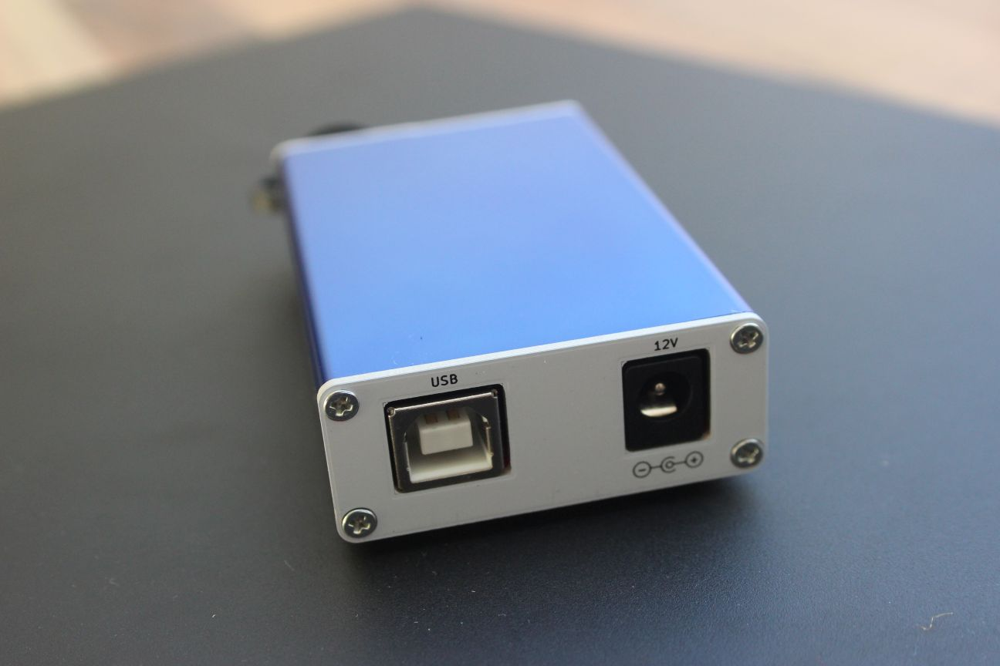

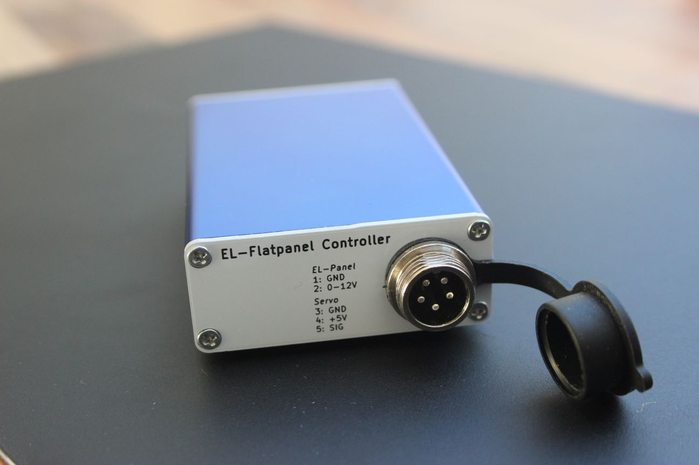

**Note**: The manufacturer JLCPCB adds by default an order number on each PCB. If you spend \$1.50 more, you can choose an [option to get the PCB without the order number](https://support.jlcpcb.com/article/28-how-to-put-jlc-production-id-at-a-specified-area-on-the-pcb).

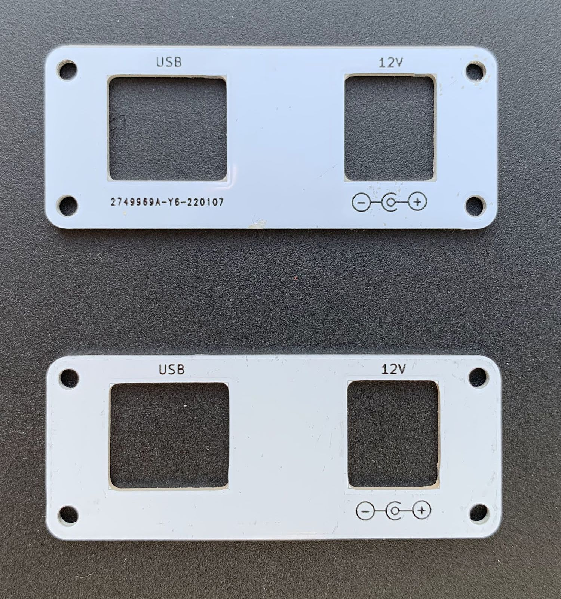

The mini-USB connector of the Arduino Nano is routed to a more reliable USB-B connector. Supply voltage is the usual 12V, a DC/DC converter module on the PCB provides 5V power for the servo motor. I have bought the Arduino and DC/DC converter as complete modules, all other components are just hand soldered on my own PCB (the red PCB on the image). 

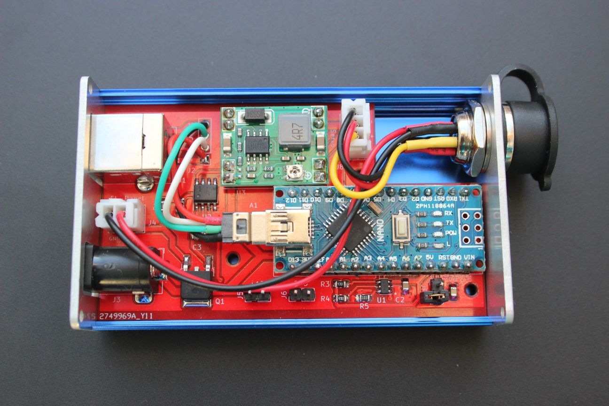

**Note**: The DC/DC converter has adjustable output voltage and must be adjusted to a voltage fitting the servo (usually 5V).

## Servo

The servo is an RDS3115 with a range of 270 degrees. With my servo attachment about 225 degrees can be used.

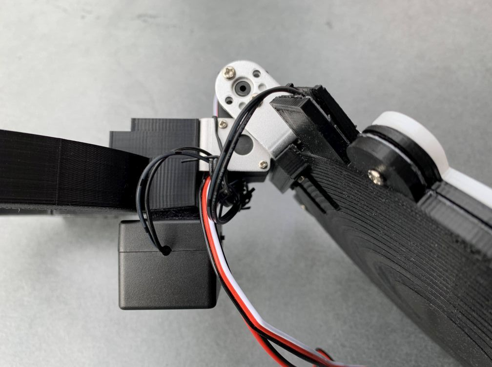
